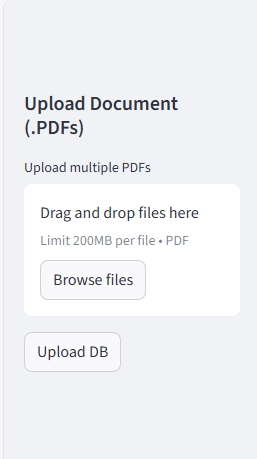
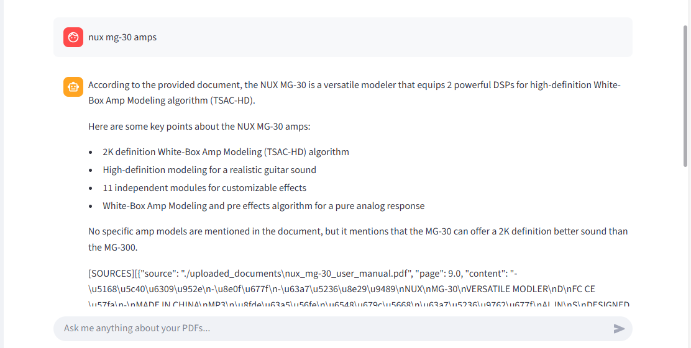

# Guitar Effect Pedal Research Assistant

A research assistant RAG based web app built with **FastAPI** and **Streamlit** that helps guitarists upload and read effect pedal manuals.  
You can upload your own PDFs or immediately start asking questions from already uploaded pedal manuals.

---

## Features

- Upload and process **PDF manuals**  
- **OCR support** for scanned PDFs (Google Vision)  
- **Semantic search** powered by Pinecone vector database  
- **LLM-powered answers** with sources  
- Out-of-the-box access to **preloaded guitar pedal manuals**  

---

## Screenshots

### Upload Manuals



### Ask Questions



---

## Tech Stack

- **Backend:** FastAPI  
- **Frontend:** Streamlit  
- **OCR:** Google Vision API  
- **Vector Database:** Pinecone  
- **Embeddings:** VoyageAI  
- **LLM:** Groq  

---

## Deployment

- **Backend (FastAPI):**  
  https://research-assistant-oe9n.onrender.com  

- **Frontend (Streamlit):**  
  https://guitar-assistant.streamlit.app/  

---

## Quick Start (Users)

1. Visit the frontend: [Streamlit App](https://guitar-assistant.streamlit.app/)  
2. Upload a guitar pedal manual **or** start asking questions about preloaded ones (like the **NUX MG-30**).  
3. Get answers with cited sources directly from the manuals.  

---

## Local Setup (Developers)

Clone the repo:
```bash
git clone https://github.com/yourusername/research-assistant.git
cd research-assistant
```

### Backend (FastAPI)

```bash
cd backend
pip install -r requirements.txt
uvicorn main:app --reload
```

### Frontend (Streamlit)

```bash
cd frontend
pip install -r requirements.txt
streamlit run app.py
```

---

## Render Deployment

1. Push repo to GitHub.  
2. On Render:  
   - Create **Web Service** for backend (FastAPI).  
   - Create **Streamlit App** for frontend.  
3. Configure environment variables:  
   - `GOOGLE_APPLICATION_CREDENTIALS`  
   - `PINECONE_API_KEY`  
   - `VOYAGEAI_API_KEY`  
4. Deploy and link frontend to backend API URL.  

---

## Roadmap

- Multi-user support  
- Authentication  
- Advanced analytics  
